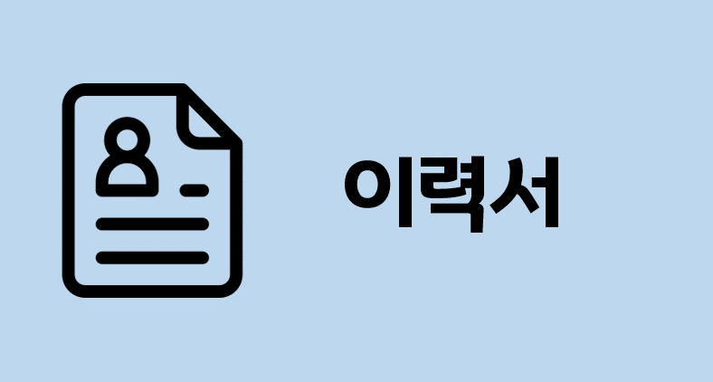

  

<h3 align="center">✨ 연락처 ✨</h3>

  
  
  
  <a href="https://www.notion.so/woogun/276bd105b9144138aec341ca46d0a315" style="text-decoration: none;">
    &nbsp
  </a>
  <a href="https://geonu-study0820.tistory.com/24" style="text-decoration: none;">
    &nbsp
  </a>

 

<h3 align="center">✨ Tech Stack ✨</h3>

  &nbsp
  &nbsp
  &nbsp

  &nbsp
  &nbsp
  &nbsp

 

<h3 align="center">🛠 Tools 🛠</h3>

  &nbsp
  &nbsp
  &nbsp

  &nbsp
  &nbsp
  &nbsp

 

  &nbsp;
  

---
<h3 align="center">📋 Resume & Portfolio 📋</h3>

  
  
  
  

