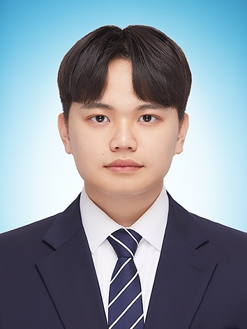
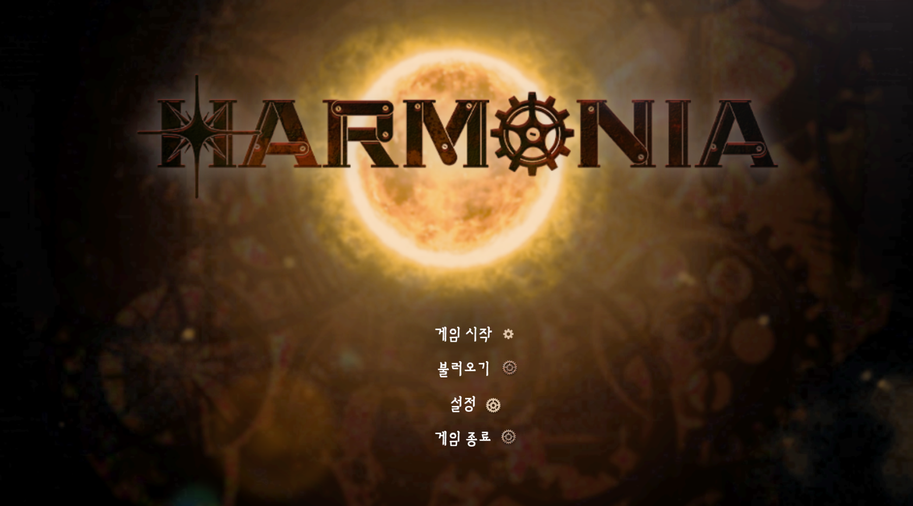

# 김건우 (Gunwoo Kim)

<table width="100%" style="border: 1px solid #ddd; padding: 20px; margin-bottom: 30px;">
<tr>
<td width="25%">
  
</td>
<td width="75%" style="padding: 0 30px;">
  <h1 style="font-size: 2.5em; margin-bottom: 20px;">김건우 (Gunwoo Kim)</h1>
  <blockquote style="font-size: 1.2em; margin: 20px 0; padding: 10px 20px; border-left: 4px solid #ddd;">
    "즐거움으로 시작하는 도전적인 여정" 
    "좌절도 경험으로 만드는 개발자"
  </blockquote>
  <h3 style="margin: 20px 0;">게임 프로그래머</h3>
  
2000년생 | 26세 

  

    

      Email: rjsdn9008@gmail.com 
      Blog: <a href="https://www.notion.so/woogun/" style="color: #0066cc;">Notion</a> 
      GitHub: <a href="https://github.com/genwo123" style="color: #0066cc;">genwo123</a>
    

  

</td>
</tr>

<tr>
<td colspan="2" style="padding: 20px 0;">
  <h3>🎓 Education</h3>
  

    <ul style="list-style-type: none; padding-left: 0; margin: 0;">
      <li style="margin-bottom: 25px;">
        <h4 style="margin: 0 0 10px 0;">연암공과대학교 스마트소프트웨어학과</h4>
        
2019.03 ~ 2024.02

        
GPA: 3.8/4.5

      </li>
      <li>
        <h4 style="margin: 0 0 10px 0;">연암공과대학교 스마트소프트웨어학과 심화과정</h4>
        
2024.03 ~ 2025.02

        
학사학위 과정 이수중

      </li>
    </ul>
  

</td>
</tr>

<tr>
<td colspan="2" style="padding: 20px 0;">
  <h3>📋 Certification</h3>
  

    <ul style="list-style-type: none; padding-left: 0; margin: 0;">
      <li>
        <h4 style="margin: 0 0 10px 0;">SQLD | 한국데이터산업진흥원</h4>
        
데이터베이스 설계 및 SQL 개발 전문자 자격

      </li>
    </ul>
  

</td>
</tr>

<tr>
<td colspan="2" style="padding: 20px 0;">
  <h3>✨ Achievements</h3>
  

    <ul style="list-style-type: none; padding-left: 0; margin: 0;">
      <li style="margin-bottom: 15px;"> AWS 리빙랩 글로벌 해커톤 대상 (2024.08)</li>
      <li style="margin-bottom: 15px;"> 연암공과대학교 혁신지원사업 은상 (2024.01)</li>
      <li style="margin-bottom: 15px;"> 동명대학교 지식재산교육선도대학사업단 우수상 (2023.10)</li>
      <li> 경남소프트웨어경진대회 입선 (2023.11)</li>
    </ul>
  

</td>
</tr>

<tr>
<td colspan="2" style="padding: 20px 0;">
  <h3>💂 Military</h3>
  

    <ul style="list-style-type: none; padding-left: 0; margin: 0;">
      <li style="margin-bottom: 15px;">
        <h4 style="margin: 0 0 10px 0;">육군 병장 만기 전역</h4>
        
21사단 "백두산부대" 통신병

      </li>
      <li>
        
복무기간: 2019.10.28 ~ 2021.05.14

      </li>
    </ul>
  

</td>
</tr>
</table>

## 📸 Highlights

  <table width="100%">
    <tr>
      <td width="33%" align="center">
        
        
      </td>
      <td width="33%" align="center">
        
        
      </td>
      <td width="33%" align="center">
        
        
      </td>
    </tr>
    <tr>
      <td width="33%" align="center" style="padding: 15px; border-top: 1px solid #eee;">
        <strong>AWS 리빙랩 글로벌 해커톤</strong>
         대상 수상 및 AWS 서비스 개발
      </td>
      <td width="33%" align="center" style="padding: 15px; border-top: 1px solid #eee;">
        <strong>스마일게이트 퓨처랩 챌린지</strong>
         게임 개발 심화 학습 및 발표
      </td>
      <td width="33%" align="center" style="padding: 15px; border-top: 1px solid #eee;">
        <strong>전공동아리 TripleS</strong>
         3년 연속 동아리장 및 2년연속 동아리 공모전 은상 수상
      </td>
    </tr>
  </table>

## 🛠 핵심 기술 스택

### 🎮 게임 개발
* **Unreal Engine 4/5**: 3개 프로젝트 완성 (어드벤처, 퍼즐, 멀티플레이어)
* **C++/Blueprint 하이브리드 개발**: 컴포넌트 기반 아키텍처 설계
* **네트워크 프로그래밍**: 12명 동시접속 멀티플레이어, Steam SDK 연동
* **시스템 최적화**: RPC/Replication, 서버 권한 모델, 메모리 관리

### 💻 프로그래밍 & 도구
* **Languages**: C/C++, Blueprint Visual Scripting
* **Development Tools**: Visual Studio 2022, DirectX 12 학습
* **Version Control**: Git/GitHub, SourceTree 활용
* **Project Management**: 팀 리더십, 비개발자 소통 경험

## 🎮 주요 프로젝트

<table width="100%" style="border: 1px solid #ddd; border-radius: 8px; margin-bottom: 20px;">
<tr>
<td width="30%" style="padding: 15px;">

</td>
<td width="70%" style="padding: 15px;">
<h3><a href="https://github.com/genwo123/Y2S3_MISINJEON_CPP">미신전 (未信殿)</a></h3>
1인칭 어드벤처 퍼즐 게임 | 2024.09 ~ 2024.10
  
• <strong>역할</strong>: 프로젝트 리더, 메인 프로그래머 
• <strong>팀구성</strong>: 6명 (디자이너 3, 개발자 2, 사운드 1) 
• <strong>기술스택</strong>: UE5, C++/Blueprint 하이브리드 
• <strong>핵심기능</strong>: 상호작용 시스템, 인벤토리, AI 시스템
</td>
</tr>
</table>

<table width="100%" style="border: 1px solid #ddd; border-radius: 8px; margin-bottom: 20px;">
<tr>
<td width="30%" style="padding: 15px;">

</td>
<td width="70%" style="padding: 15px;">
<h3><a href="https://github.com/genwo123/Harmonia">하모니아 (Harmonia)</a></h3>
SF 퍼즐 어드벤처 게임 | 2025.02 ~ 2025.10
  
• <strong>역할</strong>: 메인 프로그래머, 기술 총괄 
• <strong>팀구성</strong>: 7명 (기획 2, 디자이너 3, 개발자 1, 사운드 1) 
• <strong>기술스택</strong>: UE5, Enhanced Input System, Data Table 
• <strong>핵심기능</strong>: 레이저 퍼즐 시스템, 대화 시스템, UI/UX
</td>
</tr>
</table>

<table width="100%" style="border: 1px solid #ddd; border-radius: 8px;">
<tr>
<td width="30%" style="padding: 15px;">

</td>
<td width="70%" style="padding: 15px;">
<h3><a href="https://github.com/genwo123/BridgeRun">브릿지런 (BridgeRun)</a></h3>
멀티플레이어 액션 게임 | 2024.11 ~ 2025.12
  
• <strong>역할</strong>: 1인 개발 (풀스택) 
• <strong>기술스택</strong>: UE4, Steam SDK, 데디케이티드 서버 
• <strong>핵심기능</strong>: 12명 동시접속, 물리 기반 캐릭터, 네트워크 최적화 
• <strong>특징</strong>: 무경험에서 멀티플레이어 완성까지 도전
</td>
</tr>
</table>

## 💻 협업 프로젝트

| 프로젝트 | 설명 | 역할 | 기간 | 성과 |
|----------|------|------|------|------|
| **[팅커벨](https://github.com/genwo123/WhatAbout)** | 청년층 전세사기 예방 AI 솔루션 | 프론트엔드 리드 | 2024.08 | **AWS 해커톤 대상** |
| **[UFO's](https://github.com/genwo123/UFOs)** | 대학축제 QR 주문관리 시스템 | PM | 2024.05 | 실제 축제 적용 |
| **[너나묵자](https://github.com/genwo123/NNMJ_Project)** | 기숙사생 배달 파트너 매칭 앱 | 기술 리드 | 2022.11 | 프로토타입 완성 |
| **[군장존](https://github.com/genwo123/gunjangzone)** | 웹 기반 RPG 게임 스펙 분석 도구 | 개발자 | 2024.05 | 기능 구현 완료 |

## 🌱 활동 & 성장

### 🏆 리더십 경험
- **전공동아리 TripleS**: 3년 연속 동아리장 (50명+ 회원 관리)
- **코딩테스트 스터디 그룹**: 운영 및 멘토링
- **프로젝트 매니지먼트**: 다수 협업 프로젝트 PM 경험
- **2년 연속 동아리 공모전 은상** 수상

### 📚 학습 & 연구 활동
- **[스마일게이트 퓨처랩 챌린지](https://github.com/genwo123/UE_CPP_LectureSummary)**: Unreal Engine C++ 심화 학습
- **[GSKO 2023 논문 공모전](https://github.com/genwo123/genwo123/blob/master/docs/pdf/코딩교육과게임제작의연계성_김건우.pdf)**: 코딩교육과 게임제작 연계성 연구
- **플린디 1기**: 게임 분석 & 리뷰 프로그램 참여
- **[알고리즘 아카이브](https://github.com/genwo123/Algorithm-Solutions)**: 코딩테스트 문제풀이 정리

### 🎯 개인 성장
- **2021~현재**: 분기별 정기 헌혈 참여
- **[학습 노트](https://www.notion.so/woogun/3101e2b373e140ec9b1d77bcd8e15cb7?v=7b998d1df28742cc9d72e430ca9e5830)**: 게임 개발 서적 학습 및 리뷰
- **지속적 자기계발**: 새로운 기술 학습 및 적용

---

## 💡 핵심 역량 요약

### 🚀 언리얼 엔진 전문성
2년간 3개 게임 프로젝트를 통해 로컬 싱글플레이어부터 Steam 연동 멀티플레이어까지 개발 경험 보유

### 🌐 네트워크 프로그래밍 도전
무경험에서 시작하여 12명 동시 접속 멀티플레이어 게임 완성, RPC/Replication 최적화 구현

### 🛠 문제 해결 & 최적화
스파게티 코드 → 체계적 리팩토링, 인터페이스 패턴 도입, 네트워크 트래픽 최적화 경험

### 👥 팀 리더십 & 소통
비개발자와의 원활한 협업, PM 경험, 팀 분위기 메이커 역할로 프로젝트 성공 이끌어냄

---

**"사용자 경험을 최우선으로 하는 안정적이고 확장 가능한 게임 시스템 개발이 목표입니다"**

📧 **rjsdn9008@gmail.com** | 🐙 **[GitHub](https://github.com/genwo123)** | 📝 **[포트폴리오 상세보기](https://github.com/genwo123/genwo123)**

