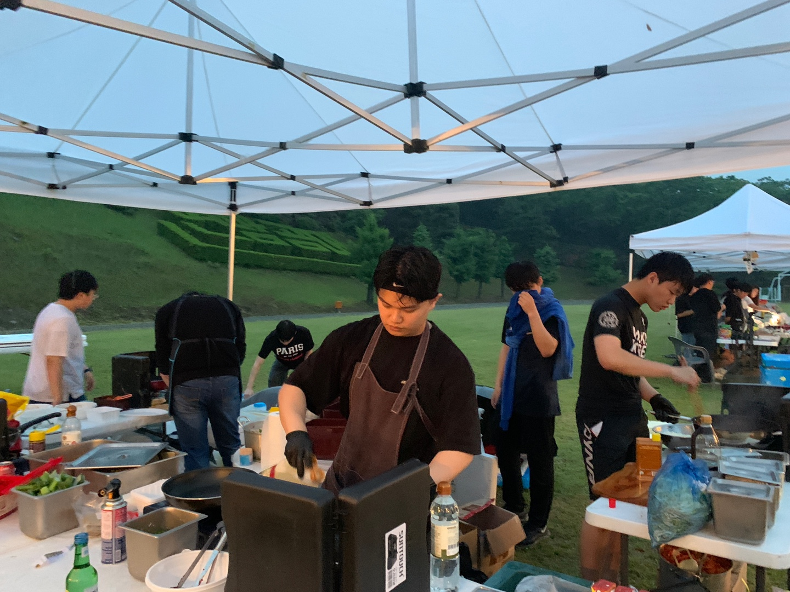

  
  
  # 김건우 (Gunwoo Kim)
  > "자유로운 도전과 화합을 통한 게임 개발"
  
  #### 새로운 경험을 만드는 게임 개발자

## 📞 Contact
- Email: rjsdn9008@gmail.com
- Blog: [Tistory](https://geonu-study0820.tistory.com/24)
- GitHub: [genwo123](https://github.com/genwo123)

## 📸 Highlights

  <table>
    <tr>
      <td></td>
      <td></td>
      <td></td>
    </tr>
    <tr>
      <td align="center">AWS 해커톤 대상 수상</td>
      <td align="center">스마일게이트 캠퍼스</td>
      <td align="center">팀 프로젝트 활동</td>
    </tr>
  </table>

## 🎯 About Me
끊임없는 도전을 통해 성장하는 게임 개발자입니다. Unreal Engine을 활용한 프로젝트 경험을 통해 사용자에게 새로운 경험을 전달하는 것을 목표로 하고 있습니다. 게임 개발의 전 과정에서 기술적 도전을 즐기며, 특히 게임 플레이 로직과 인터랙션 시스템 구현에 강점이 있습니다.

## 👥 Team Stories
### 미신전 프로젝트
> "건우는 팀의 기술적 성장을 이끌어냈습니다. 새로운 기능을 연구하고 공유하는 문화를 만들었죠."
> 
> *- 김OO, 프로그래머*

> "문제 해결 과정에서 항상 팀원들의 의견을 경청하고 존중하는 모습이 인상적이었습니다."
> 
> *- 이OO, 디자이너*

### AWS 해커톤
> "기술적 난관에 부딪혔을 때도 긍정적인 태도로 팀을 이끌었습니다."
> 
> *- 박OO, 백엔드 개발자*

## 🛠 Technical Skills
### Core
- Unreal Engine 5 (C++, Blueprint)
- DirectX
- 게임 수학/물리

### Programming
- C/C++
- React.js
- JavaScript

### Tools
- Git/GitHub
- Visual Studio
- VS Code

## 🎮 Game Projects

### 미신전 (未信殿)

  

어드벤처 퍼즐 게임 | 2024.09 ~ 2024.10
- Unreal Engine 5를 활용한 2인 개발 프로젝트
- C++/Blueprint 하이브리드 방식으로 코어 시스템 구현
- [프로젝트 상세보기](https://github.com/genwo123/Y2S3_MISINJEON_CPP)

### 브릿지런 (BridgeRun)

  

전략 액션 게임 | 2024.10 ~ 현재
- Unreal Engine 5 기반 멀티플레이어 게임 개발
- 네트워크 최적화 및 물리 기반 캐릭터 시스템 구현
- [프로젝트 상세보기](https://github.com/genwo123/BridgeRun)

## 💻 Collaboration Projects

### What About
AWS 리빙랩 해커톤 대상 수상작 | 2024.08
- AWS 클라우드 기반 서비스 개발
- [프로젝트 상세보기](https://github.com/genwo123/WhatAbout)

### UFO's (University Festival Order System)
축제 주문 관리 시스템 | 2024.07
- QR 코드 기반 주문 시스템 개발 
- [프로젝트 상세보기](https://github.com/genwo123/UFOs)

### 너나묵자 (Neonamukja)
배달 커넥팅 앱 | 2024.06
- 기숙사생 배달 파트너 매칭 서비스
- [프로젝트 상세보기](https://github.com/genwo123/NNMJ_Project)

### RPG Inspection
게임 스펙 검사기 | 2024.05
- 웹 기반 RPG 게임 스펙 분석 도구
- [프로젝트 상세보기](https://github.com/RPG-Inspection/front)

## 🏆 Awards & Achievements
- AWS 리빙랩 글로벌 해커톤 대상 (2024.08)
  - [프로젝트 상세 내용]
- 연암공과대학교 혁신지원사업 은상 (2024.01)
- 동명대학교 지식재산교육선도대학사업단 우수상 (2023.10)
- 경남소프트웨어경진대회 입선 (2023.11)

## 🎓 Education
**연암공과대학교** (2024.03 ~ 2024.12)
- 스마트소프트웨어학과(심화)
- GPA: 3.13/4.5

## 📚 Research & Studies
- "게임 개발 교육의 현황과 문제점: 코딩 교육과 게임 제작의 연계성" 논문
- "휴식게이지" 게임 시스템 연구 프로젝트
- 프로그래머스 코딩 테스트 스터디 운영 (2LV)

## 🌱 Growth & Activities
- **지속적인 사회 공헌**: 2019-2024, 분기별 1회 이상 헌혈 참여
- **게임 개발 스터디**: 언리얼 엔진 스터디 그룹 운영
- **기술 블로그**: 주 1회 이상 개발 경험 공유

## 🎖 Military Service
- 육군 병장 만기 전역
- 2019.10.28 ~ 2021.05.14

## 📋 Additional Information
*상세 개인정보 및 추가 정보는 PDF 버전 이력서 참조*
- 거주지: [PDF 버전 참조]
- 생년월일: [PDF 버전 참조]
