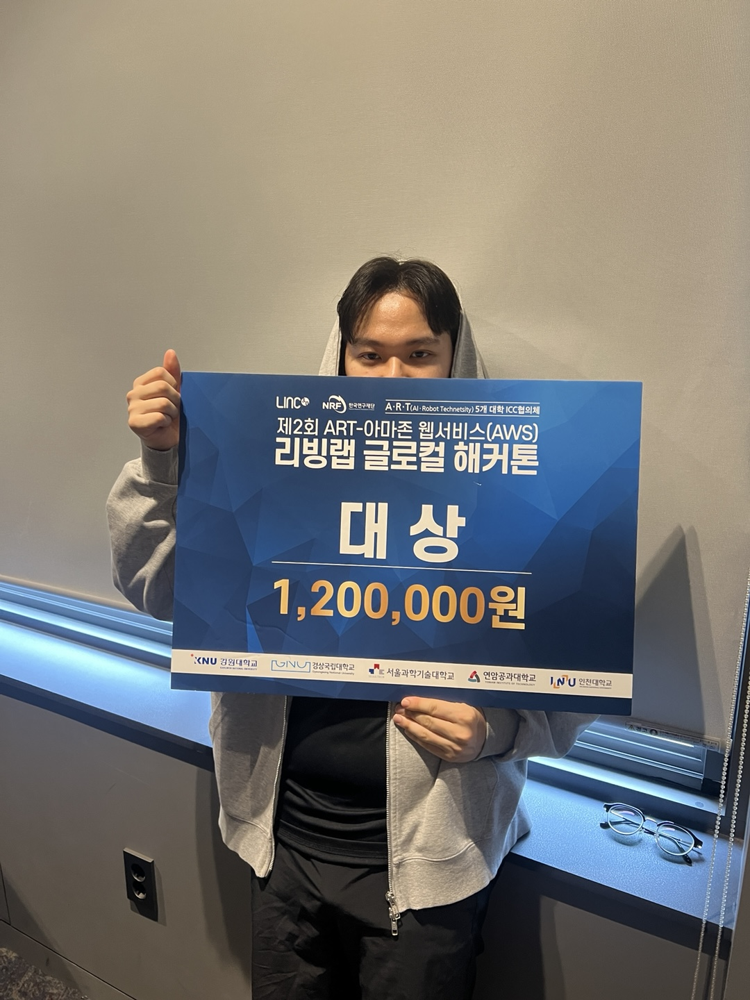

  
  
  # 김건우 (Gunwoo Kim)
  > "즐거움으로 시작하는 도전적인 여정"  
  > "좌절도 경험으로 만드는 개발자"

  #### 익숙함 속에서 즐거움을 이끌어내는 게임 개발자

## 📞 Contact
- Email: rjsdn9008@gmail.com
- Blog: [Notion](https://www.notion.so/woogun/)
- GitHub: [genwo123](https://github.com/genwo123)

## 📸 Highlights

  <table>
    <tr>
      <td></td>
      <td></td>
    </tr>
    <tr>
      <td colspan="2" align="center">AWS 리빙랩 글로벌 해커톤 대상 수상</td>
    </tr>
  </table>

  <table>
    <tr>
      <td></td>
      <td></td>
    </tr>
    <tr>
      <td colspan="2" align="center">스마일게이트 퓨처랩 챌린지 참여</td>
    </tr>
  </table>

  <table>
    <tr>
      <td></td>
      <td></td>
    </tr>
    <tr>
      <td colspan="2" align="center">전공동아리 TripleS 운영 및 수상 실적</td>
    </tr>
  </table>

## 🎯 About Me
끊임없는 도전을 즐기며 성장하는 게임 개발자입니다. 실패를 두려워하지 않고 좌절조차 값진 경험으로 만들어가며, 주어진 역할에서 최선을 다하는 것에서 즐거움을 찾습니다. Unreal Engine을 활용한 프로젝트들을 통해 익숙한 환경에서도 새로운 재미를 발견하는 것을 목표로 하고 있으며, 게임 플레이 로직과 인터랙션 시스템 구현에 관심이 있습니다.

## 🛠 Technical Skills
### Game Development
- **Unreal Engine**: UE4/5 상용 게임 개발 경험, C++ 기반 게임플레이 프레임워크 구현
  - 멀티플레이어 게임 개발 및 네트워크 최적화
  - 게임플레이 프레임워크 설계 및 구현
  - Blueprint & C++ 하이브리드 개발 경험

- **Game Programming**
  - DirectX 기반 렌더링 시스템 구현
  - 물리 기반 캐릭터 컨트롤러 개발
  - 게임 수학/물리 알고리즘 구현

### Programming & Tools
- **Languages**: 
  - C/C++: 게임 엔진 프로그래밍, 알고리즘 구현
  - JavaScript/React.js: 웹 프론트엔드 개발, 실시간 데이터 처리

- **Development Environment**:
  - Visual Studio/VS Code를 활용한 크로스 플랫폼 개발
  - Git/GitHub 기반 협업 및 버전 관리
  - 코드 리뷰 문화 주도 및 팀 생산성 향상

## 🎮 Game Projects
### [미신전 (未信殿)](https://github.com/genwo123/Y2S3_MISINJEON_CPP)

  

어드벤처 퍼즐 게임 | 2024.09 ~ 2024.10
- Unreal Engine 5를 활용한 2인 개발 프로젝트
- C++/Blueprint 하이브리드 방식으로 코어 시스템 구현

### [브릿지런 (BridgeRun)](https://github.com/genwo123/BridgeRun)

  

전략 액션 게임 | 2024.10 ~ 현재
- Unreal Engine 5 기반 멀티플레이어 게임 개발
- 네트워크 최적화 및 물리 기반 캐릭터 시스템 구현

## 💻 Collaboration Projects
### [팅커벨](https://github.com/genwo123/WhatAbout)
AWS 리빙랩 해커톤 대상 수상작 | 2024.08
- 청년층 전세사기 예방과 안전한 주거 계약을 지원하는 AI 기반 통합 솔루션
- AWS 클라우드 기반 서비스 개발

### [UFO's (University Festival Order System)](https://github.com/genwo123/UFOs)
축제 주문 관리 시스템 | 2024.05
- QR 코드 기반
- 대학 축제 주문 & 관리 시스템 개발 

### [너나묵자 (Neonamukja)](https://github.com/genwo123/NNMJ_Project)
배달 커넥팅 앱 | 2022.11
- 기숙사생 배달 파트너 매칭 서비스

### [군장존](https://github.com/genwo123/gunjangzone)
게임 스펙 검사기 | 2024.05
- 웹 기반 RPG 게임 스펙 분석 도구

## 👥 Team Stories
### 미신전 프로젝트
> "건우는 팀의 기술적 성장을 이끌어냈습니다. 새로운 기능을 연구하고 공유하는 문화를 만들었죠."
> 
> *- 김OO, 프로그래머*

> "문제 해결 과정에서 항상 팀원들의 의견을 경청하고 존중하는 모습이 인상적이었습니다."
> 
> *- 이OO, 디자이너*

### AWS 해커톤
> "기술적 난관에 부딪혔을 때도 긍정적인 태도로 팀을 이끌었습니다."
> 
> *- 박OO, 백엔드 개발자*

## 🏆 Awards & Achievements
- AWS 리빙랩 글로벌 해커톤 대상 (2024.08)
- 연암공과대학교 혁신지원사업 은상 (2024.01)
- 동명대학교 지식재산교육선도대학사업단 우수상 (2023.10)
- 경남소프트웨어경진대회 입선 (2023.11)
- 동명대학교 지식재산교육선도대학사업단 우수상 (2022.11)

## 🎓 Education
**연암공과대학교** (2024.03 ~ 2024.12)
- 스마트소프트웨어학과(심화)
- GPA: 3.45/4.5

## 📚 Research & Studies
### [스마일게이트 퓨처랩 챌린지](https://github.com/genwo123/UE_CPP_LectureSummary) (2024.08)
- 게임 개발 관련 개인 연구 프로젝트 진행
  - Unreal Engine C++ 게임 개발 심화 학습 및 실습
  - 학습 내용 정리 및 회고 발표 진행

## 📚 Research & Studies
### 연구 및 도전
- [코딩 교육과 게임 제작의 연계성](https://github.com/genwo123/genwo123/blob/master/docs/pdf/코딩교육과게임제작의연계성_김건우.pdf) - GSKO 2023 논문 공모전

---

### 코딩 테스트 학습 자료
- [코딩테스트 정리 (노션 링크)](https://www.notion.so/woogun/e159e26900194cc38e2cbc32ebc79b26)
  - 알고리즘 문제 풀이 및 복습을 위한 정리
  - 대표적인 문제 풀이 및 해결 전략 정리
  - 전공 동아리 활동 중, 후배들에게 알고리즘 문제 풀이를 지도하며 작성한 자료 기반
---

### 독서 및 리뷰 기록
- [📚 읽은 책들 정리 (노션 링크)](https://www.notion.so/woogun/3101e2b373e140ec9b1d77bcd8e15cb7?v=7b998d1df28742cc9d72e430ca9e5830)
  - 기술 서적 및 자기계발 도서에 대한 리뷰 및 요약
  - 주요 개념 및 인사이트 정리
  - 정리 내용을 기반으로 학습 적용 사례 분석

## 🌱 Growth & Activities
### 전공동아리 TripleS 리더십
- 3년 연속 동아리장 역임 (연간 50명 이상 회원 관리)
- 주요 활동 운영:
  - 코딩테스트 스터디 그룹 조직 및 관리
  - 회원 제안 프로젝트 총괄 및 팀 매칭
  - 프로젝트 기획부터 실행까지 전반적인 관리 지원

### 플린디 1기 활동
- 게임 분석 & 리뷰 프로그램 참여
- 기존 게임의 리브랜딩 프로젝트 수행
- 게임 디자인 관점에서의 분석 역량 강화

### 개인 성장
- 2021-현재: 분기별 정기 헌혈 참여
- 게임 개발 관련 서적 학습 및 리뷰 기록

## 🎖 Military Service
- 육군 병장 만기 전역 (21사단 "백두산부대" 통신병)
- 2019.10.28 ~ 2021.05.14
